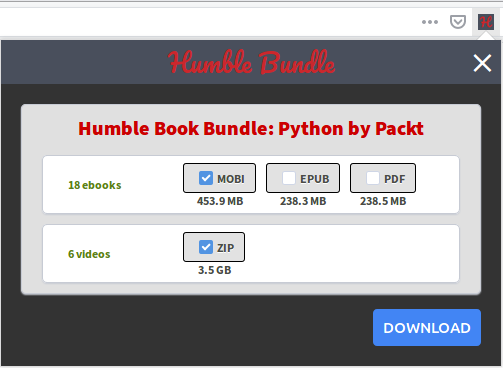
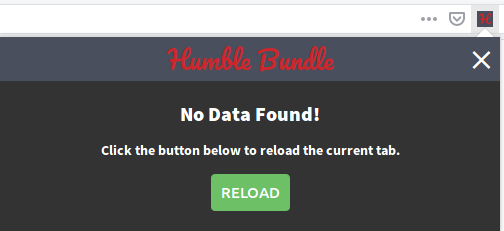

# About

This is an experimental firefox extension for downloading ebook/video
bundles from [Humble Bundle](https://www.humblebundle.com). The
extension will display an icon in the address bar when it detects it's
on a bundle download page. Clicking on the icon opens a popup
displaying either a form to download different parts of a bundle or a
message informing the user to reload the tab. Once selections have
been made and the download button has been clicked, the extension
should download the appropriate parts of the bundle to the browser's
default download directory. Here's an example of the resulting
directory for a bundle named "pythonpackt_bookbundle", when only the
mobi format for ebook and zip format for video have been selected:

```bash
/pythonbypackt_bookbundle/
├── ebook
│   └── mobi
│       ├── artificialintelligencewithpython.mobi
│       ├── buildingrestfulpythonwebservices.mobi
│       ├── expertpythonprogramming.mobi
│       ├── learningconcurrencyinpython.mobi
│       ├── learningroboticsusingpython.mobi
│       ├── masteringpython.mobi
│       ├── masteringpythonnetworking.mobi
│       ├── modernpythoncookbook.mobi
│       ├── pythondataanalysiscookbook.mobi
│       ├── pythondatascienceessentials.mobi
│       ├── pythondatastructuresandalgorithms.mobi
│       ├── pythonguiprogrammingcookbook.mobi
│       ├── pythonhighperformance.mobi
│       ├── pythonmachinelearning.mobi
│       ├── pythonmicroservicesdevelopment.mobi
│       ├── pythonprogrammingwithraspberrypi.mobi
│       ├── softwarearchitecturewithpython.mobi
│       └── webdevelopmentwithdjangocookbook.mobi
└── video
    └── zip
        ├── beginningpython_video.zip
        ├── deeplearningwithpython_video.zip
        ├── learningpythonwebpenetrationtesting_video.zip
        ├── masteringpython_video.zip
        ├── pythondesignpatterns_video.zip
        └── pythonmachinelearningprojects_video.zip
```

# Running the example

- Requirements:
  - Firefox >= 59.0
  - node v10.x
  - npm v6.x
  - Python3
  - Pip
  - Flask
  - Virtualenv

- Setup:

```bash
virtualenv -p python3 .venv
.venv/bin/pip install -r requirements.txt
```

- In a terminal window, run:
```bash
$ .venv/bin/python humblebundle-mock/app.py
```

- In another terminal window, run:
```bash
$ npm run start
```

# Build instructions

- Operating System: Ubuntu 16.04

- Requirements:
  - Firefox >= 59.0
  - node v10.x
  - npm v6.x

- Build script:

```bash
$ ./build.sh
```

# Screenshots

<p align="center">
  
</p>

<p align="center">
  
</p>
